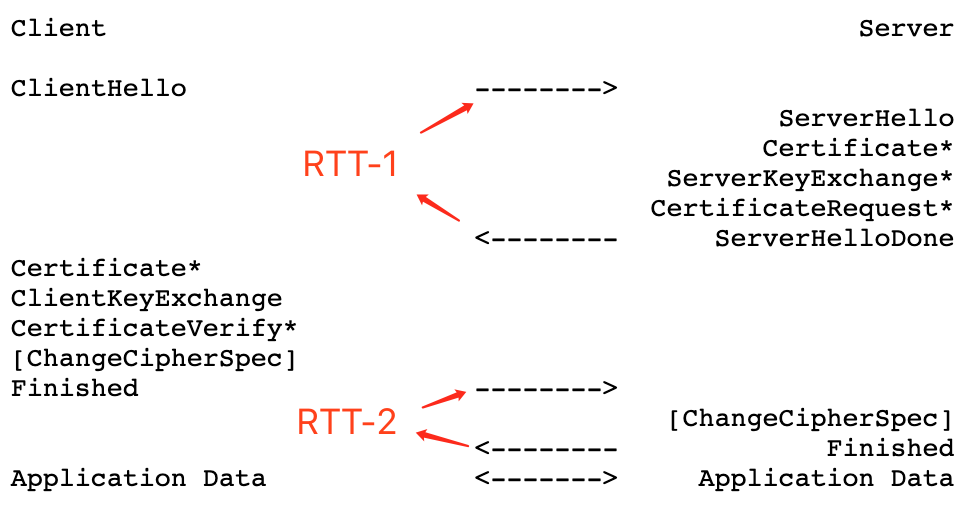
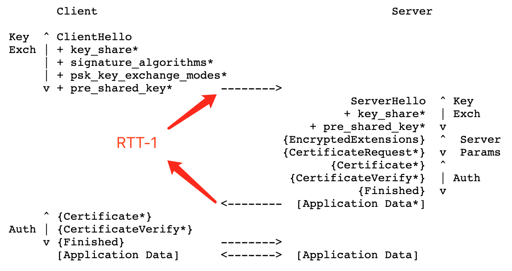
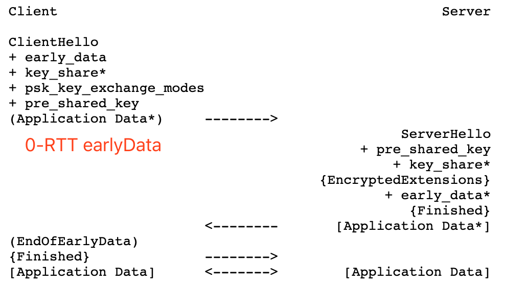

# TLS 1.3 进行时

本文是对 TLS 1.3 相关内容的一些整理和看法，包括 TLS 1.3 解决了哪些问题，带来了哪些提升，一些细节的探究，和 QUIC 的比较以及对 TLS 1.3 的看好。

## 早期版本的 TLS 存在的问题

HTTPS 已经是互联网通信的主流协议，它是互联网安全通信的保障，但是也存在一些性能问题和不少安全漏洞，从 90 年代诞生到 2018 年 TLS 1.3 出现之前的二三十年里，TLS 的握手流程都没有结构性变化，建立一个 TLS 链接需要消耗两个 RTT(round-trip time)，这导致 TLS 链接会比较慢，假设你 ping 服务器的延迟是 100ms，两个 RTT 就是 200ms，再加上 DNS 请求和 TCP 三次握手和最终的 HTTP 链接进行数据通信，你看到网站主页面开始响应的延迟起码是 400ms 以上，而人类的对 100ms 以上的延迟是有感的，根据 Amazon 的统计首页打开时间每增加 100 毫秒，网站销售量会减少 1%。伴随着 TLS 的发展，越来越多的针对性攻击也开始出现，包括 [Heartbleed](https://zh.wikipedia.org/wiki/%E5%BF%83%E8%84%8F%E5%87%BA%E8%A1%80%E6%BC%8F%E6%B4%9E) , [BERserk](https://www.aqniu.com/threat-alert/5276.html) , [goto fail;](https://www.aqniu.com/threat-alert/1877.html) ，这些是由于 TLS 实现的缺乏测试导致的，都属于代码 BUG 的范围，但是 [POODLE](https://zh.wikipedia.org/wiki/%E8%B4%B5%E5%AE%BE%E7%8A%AC%E6%BC%8F%E6%B4%9E)、[ROBOT](https://blog.myssl.com/robot-attack-detect/) 这种就是属于协议设计上的漏洞了。

## TLS 1.3 改进和重构

针对之前版本存在的问题，TLS 1.3 做出了史上最大的改版，包括握手流程的不兼容改进，重构以精简握手逻辑，去掉对不安全的加密算法支持等。

_golang1.12 开始支持 TLS 1.3，默认不启用，需要配置 `GODEBUG=tls13=1`，1.13 开始默认启用，可以配置关闭，1.14 开始不可关闭。_

### 秘钥交换

不再支持 RSA 加密共享秘钥，因其不具有向前安全保证，窃听者记录了密文数据后可以在将来某一时刻获取到 RSA 私钥后进行解密。TLS 1.3 只采用 [ECDHE](https://zh.wikipedia.org/wiki/%E6%A9%A2%E5%9C%93%E6%9B%B2%E7%B7%9A%E8%BF%AA%E8%8F%B2-%E8%B5%AB%E7%88%BE%E6%9B%BC%E9%87%91%E9%91%B0%E4%BA%A4%E6%8F%9B) 认证加密。这避免了 ROBOT Attack 漏洞。

### 对称加密算法套件

移除 CBC、RC4，只支持现阶段有安全保障的 AEAD 认证加密，避免了 POODLE 漏洞，同时搭配对应的 Hash 算法用于搭配 [HKDF](https://en.wikipedia.org/wiki/HKDF) 算法生成对称秘钥。

### 数字签名

数字签名是为了保证握手通信没有被篡改，之前版本只对部分握手通信进行签名，对算法协商部分没有签名，中间人可以针对这个弱点强制使用最弱的加密算法，TLS 1.3 则是对整个握手通信进行签名。移除了 PKCS1 签名，使用 PSS 签名，前者对相同数据的签名总是相同，会遭到 ROBOT 攻击，后者通过加随机盐的方式让签名随机化，提高了安全性。

### 算法套件正交化

将加密算法、秘钥交换算法、签名算法进行大量的精简，只保留现阶段安全的算法，同时固定了秘钥交换算法只基于 DH，这让三种类型的算法可以正交化，之前是穷举了所有可能的组合，因为有些组合是不可能的，现在是协商时从三种集合中各选其一随意组合。

## TLS 1.3 vs. 与早期版本握手

### TLS≤1.2 握手过程

**2-RTT**

1. Hello 阶段：Client/Server 交换随机数，协商加密算法、压缩算法，检查 session 恢复。
2. 秘钥交换：同意随机数和 `premaster secret`，这个值可能是 RSA 公钥加密的，也可能是 DH 临时秘钥的 pukbey，取决于 hello 阶段协商的结果，之后双方根据随机数和 `premaster secret` 生成 `master secret`，应用层数据用此 key 做对称加密。
3. 证书交换：互相认证证书，通常 web 项目不需要认证客户端证书。
4. 应用层数据在 Server 端发送 Finished 之后开始通信

<centor>TLS 1.2 2-RTT</centor>

### TLS 1.3 握手过程

**1-RTT 模式**

这是 TLS 1.3 的标准模式，可分解为下面几种逻辑。

1. 秘钥交换：Client/Server 用 `key_share` 代替 1.2 的 `master secret`，只支持 DH 算法进行秘钥交换，之后的信息都用此 `key_share` 加密。由于只支持 DH 秘钥交换所以省略了算法协商的流程，这是达成 1-RTT 的关键，因为 TLS 1.2 及之前的版本即支持 RSA 加密秘钥、又支持 DH 秘钥交换，所以需要在 `hello` 阶段进行协商。
2. 服务端参数：新增了可以自定义的应用层服务端参数，比如 ALPN(Application-Layer Protocol Negotiation)，可以选择性的与客户端建立连接。
3. 认证：互相认证证书，提供密钥确认和握手完整性
4. 应用层数据在 Server 端发送 Finished 之后开始通信

<centor>TLS 1.3 1-RTT</centor>

**0-RTT 模式**

所谓的 0-RTT 就是，通信双方发起通信连接时，第一个数据包便可以携带有效的业务数据。TLS 1.3 的 0-RTT 是受 QUIC 协议的启发，一般实现是在恢复链接时可以做到 0-RTT。

1. 根据之前的握手或者从外部得到的 `key_share` 作为 `pre_share_key`，加密 0-RTT 的应用数据，称为早期数据(early data)。在 TLS 1.2 中，有两种方法可以用于恢复连接，会话 [id 和会话 ticket](https://blog.Cloudflare.com/tls-session-resumption-full-speed-and-secure/) 。在 TLS 1.3 中，把它们合并起来以形成称为 PSK（pre-shared key）恢复的新模式。其思路是在建立会话之后，客户端和服务器可以得到称为“恢复密钥”的共享密钥。这个秘钥可以用 ID 存储在服务器上，也可以通过服务器密钥进行加密后存储，_加密 ticket 的秘钥需要定期更换，[Go 1.15 版本的 rotate 周期为 24 小时](https://github.com/golang/go/commit/43f2f5024b2a1438a642fe5340b929d3069099e9)_，会话 ticket 将发送到客户端并在恢复连接时使用。
2. 除了早期数据以外的数据，在 1-RTT 之后再用本次握手生成的新的 `key_share` 进行通信

<centor>TLS 1.3 0-RTT</centor>

**0-RTT 存在安全风险**

1. 因为握手的很多过程是异步的，服务端可能在收到客户端证书之前发送应用数据，这可能会把数据发送给未认证的客户端，不过通常 web 系统是不需要认证客户端证书的，但是服务与服务之间的通信出于安全考虑可能需要启用 mTLS 进行双向认证，所以尽量不要在这种场景使用 0-RTT 模式。
2. 会被重放攻击，如果请求不是幂等的会有事故，比如重复扣款，当然敏感业务一定要在应用层做幂等，而 HTTP GET 请求通常是幂等的，所以 0-RTT 携带的数据只能用于 GET 请求，比如大多数网站的主页都是 GET 请求，0-RTT 就会加快页面加载速度，同时也非常适合 CDN 服务。另外 TLS 的会话 ticket 是带有效期的，也可以减缓重放攻击

_Go 的实现是不支持 0-RTT 模式的。考虑到与其他 TLS 1.3 实现的兼容性，比如在相同的 IP 地址负载均衡了不同版本的服务，同时存在支持 0-RTT 的服务和不支持 0-RTT 的服务的情况，不支持的服务收到 0-RTT 请求时需要实现复杂的逻辑，还要考虑服务跳转，服务池等，目前 Go 收到 0-RTT 数据时会直接拒绝，Go 目前也没有支持 0-RTT 的 Roadmap。0-RTT 是提高”冷启动“速度的关键，但是对于服务之间的长连接来说没有意义。_

## 为什么取消了压缩算法

一个 HTTPS 链接实际上有三层链接，分别是 TCP、TLS、HTTP，以前的压缩是在 TLS 层做的（有种叫法为 6 层），在 TLS 1.2 以前可以用 gzip 压缩 header 和 body，但是 TLS 层无法感知 body 内容的意义，所以没法针对数据特点进行分类压缩，只好统一采用相同的压缩算法。而且这个算法会遭到 [CRIME](https://www.ekoparty.org/archive/2012/CRIME_ekoparty2012.pdf) 攻击，这是由于 gzip 压缩算法基于字符串匹配和动态霍夫曼编码，攻击者可以用部分请求逐渐试探请求压缩后的字节数，最终可以破解 Cookie。

HTTP/2 的一大杀器 HPACK 改善了这个问题，HPACK 压缩算法只针对 header 进行压缩，将 body 压缩交给应用层，这使得它可以针对 header 的数据特点设计最合适的算法，HPACK 与 HTTP Header 的定义深度适配，对于常见的 Header 比如 `:status: 200` 压缩后只需要传输一个字节，而对于每次请求都带上重复的 Cookie 这种常见场景，可以将通常几百字节的 Cookie 压缩到 2 字节，高达 99%的压缩率。HPACK 采用了静态加动态的 Header 字典和静态霍夫曼编码，基于 Header 数据的特点，在静态字典中记录了常见的 Header name 和 value 用一个字节直接表示，对于 value 不常见或不可枚举的会对 value 进行霍夫曼编码记录在动态字典，在最终传输时消耗两个字节，HPACK 基于大量的 HTTP Header 数据生成了 [静态霍夫曼编码表](https://tools.ietf.org/html/rfc7541#appendix-B)，用于编码其他的字符串，这大幅减缓了 CRIME 攻击，因为攻击者必须用完整的 header 名去匹配，不能用部分字符串去猜。目前还没有针对静态霍夫曼编码的攻击出现，并且根据 [PETAL](https://tools.ietf.org/html/rfc7541#ref-PETAL) 研究的结论，攻击者无法针对静态霍夫曼编码得到有用信息。来自 Cloudflare 的统计数据，HPACK 为 Request Header 提高了 76%的压缩率，为 Response Header 提高了 69%。所以 TLS 1.3 取消了压缩算法，将 Header 压缩提升到 HTTP 层，Body 压缩则交给应用层，比如 gRPC。

## TLS 1.3 vs. QUIC

QUIC 最近很火，但是 TLS 1.3 的出现可能会帮它降降火，对比一下它们的握手过程，一个 HTTPS 请求如果基于 TLS，一般会依次进行 DNS、TCP、TLS、HTTP 请求，对于 QUIC 来说则是 DNS、QUIC、HTTP

**TLS 1.3**

新建连接：DNS + 1 TCP + 1 TLS + 1 HTTP = 4-RTT

恢复连接：DSN + 1 TCP + 1 TLS + 1 HTTP = 4-RTT

**TLS 1.3 + 0-RTT**

新建连接：DSN + 1 TCP + 1 TLS + 1 HTTP = 4-RTT

恢复连接：DSN + 1 TCP + 0 TLS + 1 HTTP = 3-RTT

**QUIC**

新建连接：DSN + 1 QUIC + 1 HTTP = 3-RTT

恢复连接：DSN + 0 QUIC + 1 HTTP = 2-RTT

据 Cloudflare 统计，60% 的 HTTPS 连接是首次打开页面或者间隔较长时间打开页面，这两种情况是需要新建连接的，其余 40% 的链接则属于链接复用的情况，考虑到 DNS 的有层层缓存，所以会非常快，如果忽略 DNS 请求，TLS 1.3 和 QUIC 的性能对比大概就是：

`(3 x 0.6 + 1 x 0.4) : (2 x 0.6 + 1 x 0.4)`

即 TLS 1.3 比 QUIC 慢了约 37.5%，这是不考虑 `HTTP Keepalive` 链路复用的情况，开启 `Keepalive` 可以省去大量的 TCP+TLS 握手。实际上，根据谷歌给出的数据，QUIC 让 Google 搜索响应的延迟减少了 3.6％，让 YouTube 视频缓冲减少了 15.3％。这些数字与 2016 年的论文 [“ QUIC 有多快？”](https://ieeexplore.ieee.org/document/7510788/) 中报道的一致，作者将 QUIC 与 SPDY 和 HTTP 进行了比较。结果表明，QUIC 在高延迟条件下表现良好，尤其是对于低带宽。作者还表明，对于移动设备来说，QUIC 是最佳选择，但是对于超高带宽网络中的大量数据表现不佳，在比较 QUIC，SPDY 和 HTTP 时，这些协议中的任何一个都不比其他两个更好，实际的网络条件决定了哪种协议性能最好。而这个比较是建立在网络通畅的情况下的，只是用不同的延迟作为基准来进行比较，但是 QUIC 最大的优势是在于弱网环境用户体验。

**QUIC 针对弱网的几个特性**

1. 从数据包级别解决了队头阻塞（head-of-line blocking）问题。HTTP/2 虽然解决了 HTTP1.1 只能顺序处理每个请求的问题，但是依然没办法解决 TCP 的网络拥塞问题。但是 QUIC 的重传机制会增加每个包的冗余，这也是在通畅网络环境下性能会比如 TCP 的一个原因。
2. 并且支持连接迁移。比如 4G 到 WiFi，QUIC 不像 TCP 那样用 IP 端口四元组标识链接，而是用一个 64 位随机数。但是基于 UDP 的连接迁移是导致 QUIC 不能沿用 HPACK 的绊脚石，直接在 QUIC 中使用 HPACK 会增加队头阻塞的影响，比如 gQUIC 的实现，这导致 QUIC 必须设计一个兼容版本：QPACK，旨在保证不影响队头阻塞的前提下尽量达到 HAPCK 的压缩率，但是这确实增加了一点点传输用于同步压缩器状态。
3. 自定义用户态的拥塞控制插件。TLS 本身没有拥塞控制，是基于 TCP 的拥塞控制与 HTTP/2 的拥塞控制共同作用的，这让拥塞控制算法的调优比较复杂，而 QUIC 可以在方便的自定义拥塞控制算法，也已经有一些实践 [快手自研 kQUIC：千万级 QPS 集群是如何实现的？](https://mp.weixin.qq.com/s/ttGHI4Vxla2M_k2jsaiCTQ)。

以上这些 QUIC 的优势是可以直接影响用户体验的，但是 QUIC 的硬伤是中间设备的支持问题，换个角度来看，TCP 早就有支持连接迁移的方式，`MPTCP(Multpath TCP)`可以让 4G、WiFi 同时工作，苹果的`Siri`、华为的`Link Turbo`，三星的智能手机都是基于这个特性实现的。两条路都通的情况下，谁发展的更好就很难说了。

## 现在可以开始用 TLS 1.3 了

TLS 1.3 和 QUIC 都面临的很现实的落地问题，最大的问题都是中间设备的支持，但是后者是支持更差的，运营商一般会拒绝一些 UDP 包，而且配置的 UDP 优先级也比 TCP 要低。TLS 1.3 则为了提高其可落地性，尽可能的沿用了 TLS 1.2 的会话恢复逻辑，代价是牺牲了一些完美主义。

TLS 1.3 虽然面临着各种困难，各种版本实现的一致性，浏览器支持，中间设备的支持等，但是相比 QUIC 是更容易落地的，用汽车做个比喻，TLS 1.3 就像油电混动，而 QUIC 像是纯电，后者在现阶段肯定是无法普及的，毕竟有条件按充电桩的家庭不多。所以 TLS 1.3 的发展在短期看来会更顺利。另外，QUIC 的重传机制 ARQ 从根本上依赖于反馈信息以从数据包丢失中恢复，这就还是会增加 RTT，[Bolina](https://codavel.com/technology/) 提供了一种思路，采用纠删码来避免这个问题并给出了 [benchmark](https://blog.codavel.com/how-fast-is-quic-and-what-makes-bolina-faster-i)。但 QUIC，现改名为 HTTP/3，有着各大巨头的支持，最终的标准也还在迭代草案阶段，未来一定会成为更通用的标准，不过在当前阶段，TLS 1.3 应该是最好的选择。

---

## 参考资料

[RFC TLS 1.2](https://tools.ietf.org/html/rfc5246)

[RFC TLS 1.3](https://tools.ietf.org/html/rfc8446)

[RFC-8446-TLS 1.3 介绍](https://blog.Cloudflare.com/rfc-8446-aka-tls-1-3/)

[HPACK the Killer Feature of HTTP/2](https://blog.Cloudflare.com/hpack-the-silent-killer-feature-of-http-2/)

[RFC-7541 HPACK](https://tools.ietf.org/html/rfc7541)

[Why QUIC is not the next big thing](https://medium.com/codavel-blog/quic-vs-tcp-tls-and-why-quic-is-not-the-next-big-thing-d4ef59143efd)

[Introducing 0 RTT](https://blog.Cloudflare.com/introducing-0-rtt/)

[QPACK: Header Compression for HTTP/3 draft 16](https://tools.ietf.org/html/draft-ietf-quic-qpack-16)