# 信号量与可视化并发分析

> 图多杀猫

最近在看 CSAPP(Computer Systems: A Programmer's Perspective)这本书，虽然我看的是中文版，但是中文的书名翻译感觉不太合适。这本书确实是书如其名，作为一个工作多年的程序员， 看起来如沐春风。我印象最深刻的就是并发编程那章节介绍的一种可视化分析信号量的工具——进度图，本文就展开介绍一下它。在介绍进度图之前，我必须先啰嗦一下信号量，它提供了一种可以实现同步的原语，也是 Go 语言的关键组件之一。目前为止，我的每篇文章都离不开 Go😈。

## 信号量介绍

**信号量**（**semaphore**）是荷兰计算机科学家 Dijkstra 提出的（我最近成了他的迷弟），信号量命名应该是源于铁路的信号灯，用来控制进程的“走”还是“停”，避免忙等。
信号量的值是一个非负整数，除了初始化之外只有 PV 两个操作：

- P（荷兰语 proberen，尝试），等待信号量为正数
- V（荷兰语 verhogen，增加），增加信号量

> PS：在 Plan9 的设计文档里提到的 PV 所代表的荷兰语单词是不准确的，这里选用的是 CSAPP 书中记载的定义。

用代码来表达 PV 操作：

P(i)：

```
P(i) {
  waiting for i > 0;
  i = i - 1;
}
```

V(i)：

```
V(i, n) {
	i = i + n;
}
```

只有 0、1 两个值的信号量叫做 二元信号量，可以实现互斥。多个值的信号量可以实现并发队列、读写锁等。

## Golang 起源——Plan9

golang 的信号量实现在 `sema.go` 文件中，是基于之前 Google 为 Plan9 操作系统开发的[信号量](https://swtch.com/semaphore.pdf)。该设计基于硬件支持原子比较替换（`CAS`）和原子加法（`XADD`），后者是可以基于前者实现的，从 intel 486 时代开始就普遍支持了`CAS`操作。

**CAS**

```
int cas(long *addr, long old, long new) {
  if(*addr != old)
    return 0;
  *addr = new;
  return 1;
}
```

**XADD**

```
long xadd(long *addr, long delta) {
  long v;
  for(;;){
    v = *addr;
    if(cas(addr, v, v+delta))
      return v+delta;
  }
}
```

Plan9 的信号量对标的是 Linux 的 futex，为了解决传统同步机制的一些问题，他们的优化方向是一样的，尽量保持在用户态，避免换到内核态，当然它们也吐槽了 futex 发布时给出的例子是错的，直到一年后才给出了正确的版本这件事。用户态信号量比内核态信号量的好处是在非竞争时可以避免从用户态切换到内核态。

Plan9 还用信号量实现了自己的互斥锁 spin lock。传统的 spin lock 虽然在内核态工作良好，但是在用户态可能会失效，这是因为用户态可能会在刚刚抢到锁时被操作系统的进程调度器抢占，导致抢锁失败。Plan9 最初的实现是，在尝试一千次失败后 用 sleep(0) 重新获取调度时间片，最终退化到 sleep(1ms)。用信号量代替 spinlock 的好处就是不受抢占影响，不过这显然不是最优的方案。

## Go 的信号量生态

下图是我整理的 Go 基于信号量的互斥生态，它的实现是基于内部的工业级互斥锁。API 层提供给用户的很多组件都是基于信号量。可以清晰的看到，信号量是整个 Go 语言的关键组件。

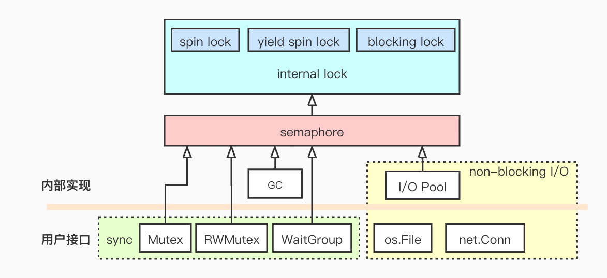

### 内部互斥锁

Go 的内部锁是一种“三阶段”锁，集 spin、yield、park 为一体。先做一些主动自旋尝试拿锁，再做被动的自旋，即放弃当前操作系统给分配的时间片等待下次被调度时再次尝试拿锁，如果经过前两个阶段的努力后还是拿不到锁，最后会调用 futex 休眠，即告诉操作系统将本线程挪到等待队列。具体代码如下：

```go
func lock2(l *mutex) {
    ...
    //单核不做spin，因为如果其他线程拿到了锁，本线程不可能在当前时间片拿到锁
    spin := 0
    if ncpu > 1 {
        spin = 4
    }
    for {
        // 在当前时间片做一些自旋
        for i := 0; i < spin; i++ {
            for l.key == mutex_unlocked {
                if atomic.Cas(key32(&l.key), mutex_unlocked, wait) {
                    return
                }
            }
            procyield(active_spin_cnt)
        }

        for i := 0; i < passive_spin; i++ {
            for l.key == mutex_unlocked {
                if atomic.Cas(key32(&l.key), mutex_unlocked, wait) {
                    return
                }
            }
            // 放弃时间片，等待重新调度，相当于sleep(0)
            osyield()
        }

        // Sleep. 调用 futex：先尝试一次，失败则进入等待队列。
        v = atomic.Xchg(key32(&l.key), mutex_sleeping)
        if v == mutex_unlocked {
            return
        }
        wait = mutex_sleeping
        futexsleep(key32(&l.key), mutex_sleeping, -1)
    }
}
```

### Go 的信号量

go 的信号量基于 Plan9 的基础上适配了 goroutine。采用 uint32 类型作为信号量的值。runtime 初始化时会创建 251 个随机平衡树（treap），维护在`semaRoot`结构体中，以此来保证调度的公平性。

```go
type semaRoot struct {
    lock  mutex
    treap *sudog // root of balanced tree of unique waiters.
    nwait uint32 // Number of waiters. Read w/o the lock.
}
```

251 是一个素数，可以做简单的 hash，对于每个信号量的地址，右移 3 位后对 251 取模哈希到不同的树中，这样是为了让内存中相邻的信号量尽量哈希到同一个树中，保持一种亲和性。

```go
func semroot(addr *uint32) *semaRoot {
    return &semtable[(uintptr(unsafe.Pointer(addr))>>3)%251].root
}
```

treap 中的每个节点是一个 sudog，它代表一个等待中的 goroutine，sudog 同时维护一个队尾指针 `waittail`，以此来实现信号量的 lifo 模式，这可以用来应对不同的饥饿场景。

```go
type sudog struct {
    g *g

    next *sudog
    prev *sudog
    elem unsafe.Pointer // data element (may point to stack)
    ...
    parent   *sudog // semaRoot binary tree
    waitlink *sudog // g.waiting list or semaRoot
    waittail *sudog // semaRoot
    c        *hchan // channel
}
```

信号量的 PV 操作会对 treap 做出队、入队的操作，这些操作的时间复杂度都是 O(1)。

### 衍生物

sync 包的 Mutex、RWMutex、WaitGroup 的实现都依赖 Go 内部的信号量。另外
I/O pool 实现的异步 I/O 也利了用信号量，文件、网络包在内部都使用了 I/O pool，这让 Go 提供给用户与传统 Linux 网络编程相当的体验，降低开发者的心智负担。

## 进度图

进度图（progress graph）可以将 n 个并发线程的执行顺序表达为一个 n 维的笛卡尔坐标系。每当我们想要分析并发问题的时候，第一个想到的工具大概是**时序图**，而进度图是非常冷门的，相关的资料非常少，当我在 CSAPP 中发现它时，就好像捡到一本失传已久的武功秘籍。在某些场景下，进度图提是比时序图更直观的且精准的并发分析方法。为了简单直观，我们可以用二维笛卡尔坐标系表达两个并发逻辑模型，下面介绍一下进度图的基本概念和分析方法。

**介绍进度图**

假设我们有一个非原子的`i++`操作，编译器会把它分成三条指令，即:

```asm
movl   %rbp, %ecx // get
addl   $0x1, %ecx // add
movl   %ecx, %rbp // set
```

为了避免并发执行导致错误的结果，可以用信号量做一个互斥。如下图，横轴和纵轴各自代表一个并发线程，刻度上的数字则代表信号量在当前位置的值，原点代表初始状态，刻度之间是线程执行的操作，箭头代表两个线程的同步化进度，从原点开始出发，只能向右或向上步进，而信号量为负数的区域则代表不安全区域。

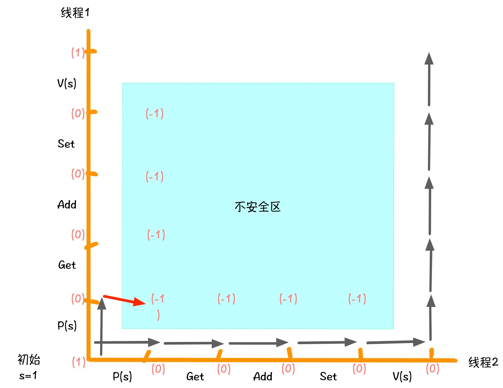

进度图还可以帮助我们很清晰的分析死锁的可能性，如下图，死锁区是可以进入的，但是一旦进入后就无路可走了。

**进度图分析死锁**

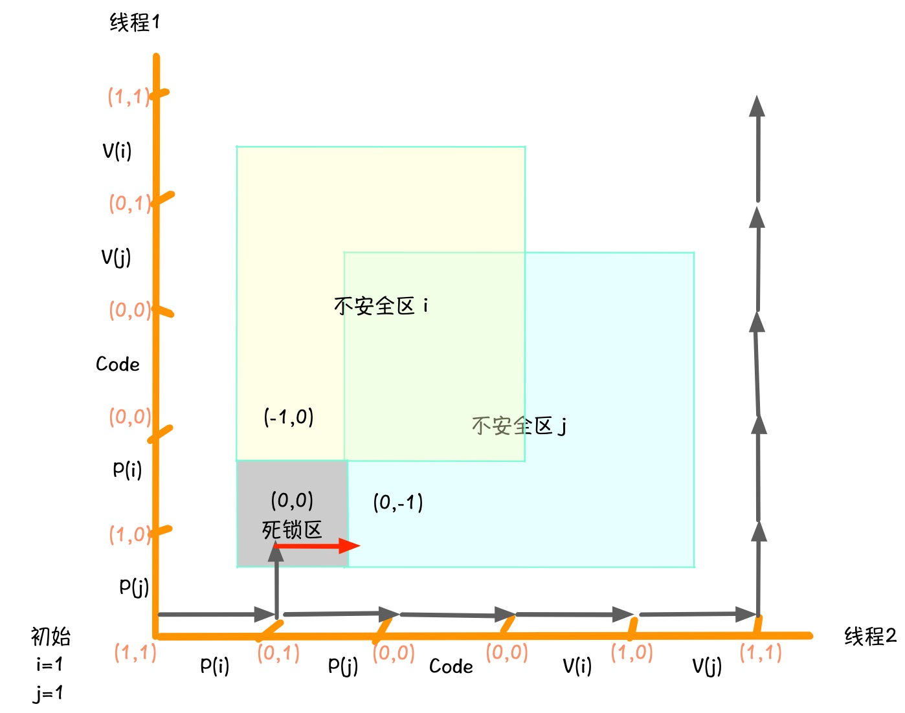

**解除死锁**

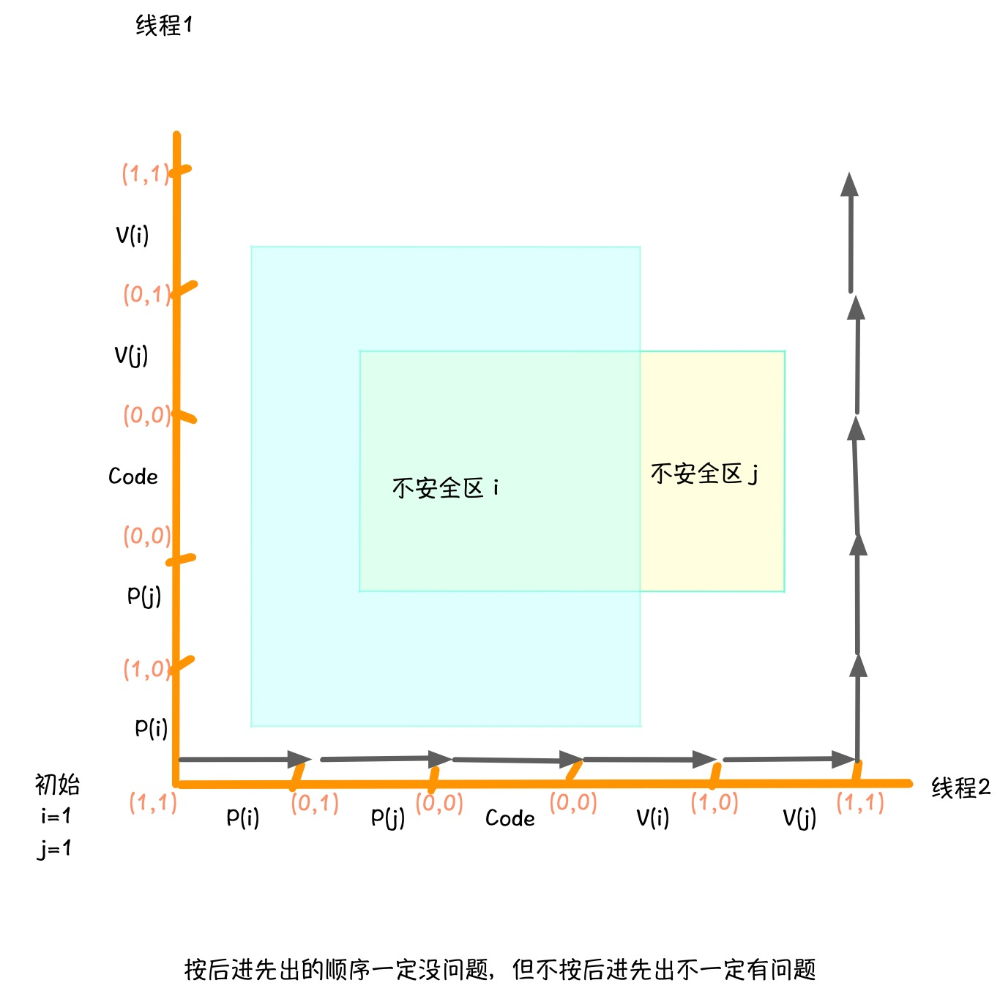

可以看到，用进度图分析二元信号量是非常直观的，这是因为互斥信号量有一个特点：**在同一个线程里，每个互斥量的 P 和 V 操作总是会成对出现**。但是，用信号量实现的其他功能就没有这个前提了，比如**并发队列**。Go 的 channel 就是一种并发队列，只不过它的实现不太一样，下面我试着用经典的并发队列来分析一下。

**并发队列的经典实现 C**

```c
struct cqueue {
  int *buf   // init malloc n
  int n      // size of queue
  int front  // init 0
  int rear   // init 0
  sema mutex // init 1
  sema slots // init n
  sema items // init 0
}

void write(cqueue *q, int item) {
  P(q.slots)
  P(q.mutex)
  p->buf[(++q->rear)%(q->n)] = item // enqueue
  V(q->mutex)
  V(q->items)
}

int read(cqueue *q) {
  int item
  P(q->items)
  P(q->mutex)
  item = q->buf[(++q->front)%(q->n)] // dequeue
  V(q->mutex)
  V(q->slots)
  return item
}
```

**用进度图分析并发队列**

并发队列
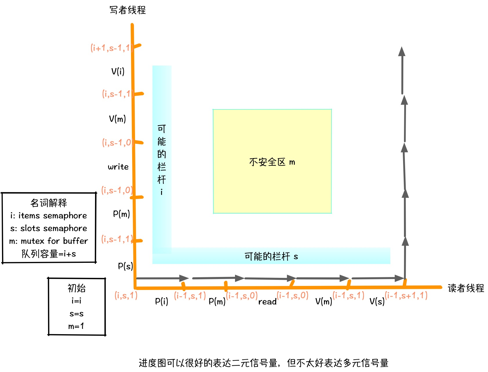

多元信号量的不安全区不太好直观的展现出来，这里我引入一个新的可视化组件**栏杆**（我发明的）来表示可能存在的一种情况，即**挡住来路**。另外，由于多元信号量的初始值可能有多种情况，所以我需要把情况拆开来分析。

读/写线程，队列容量为 1
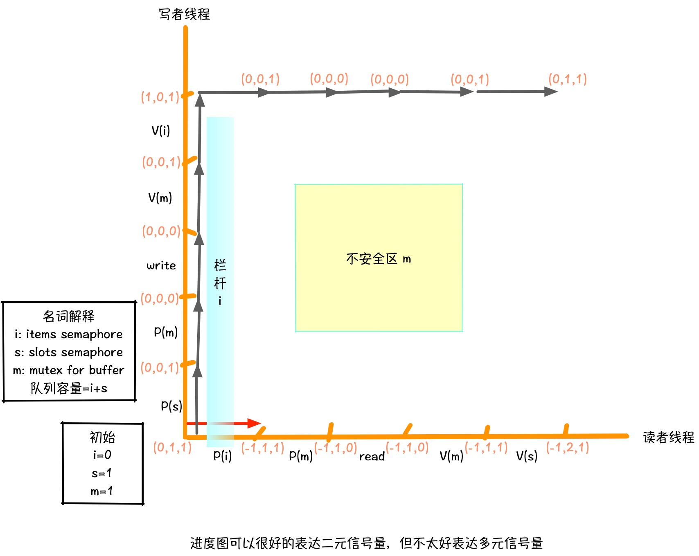

读/写线程，队列容量为 2
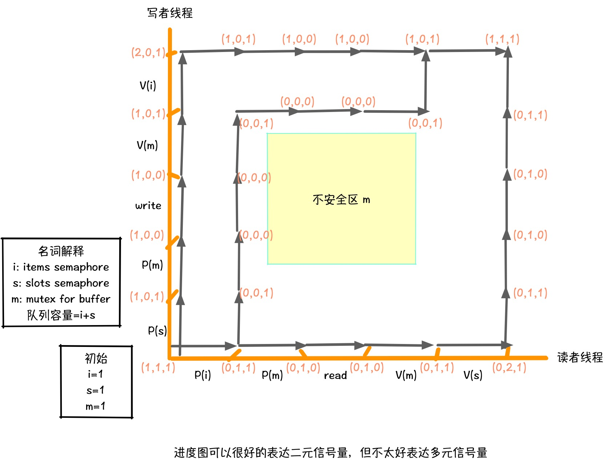

写/写线程
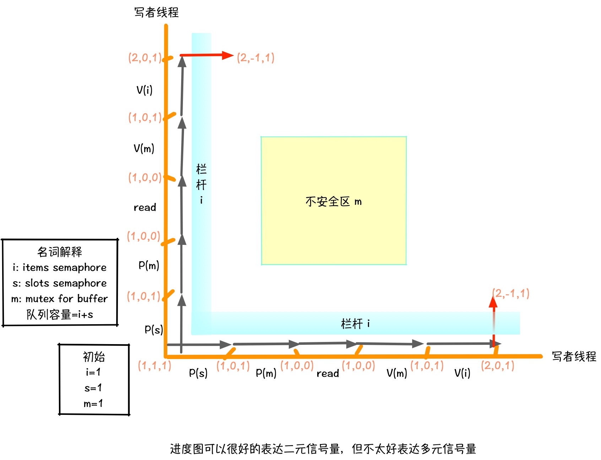

读/读线程
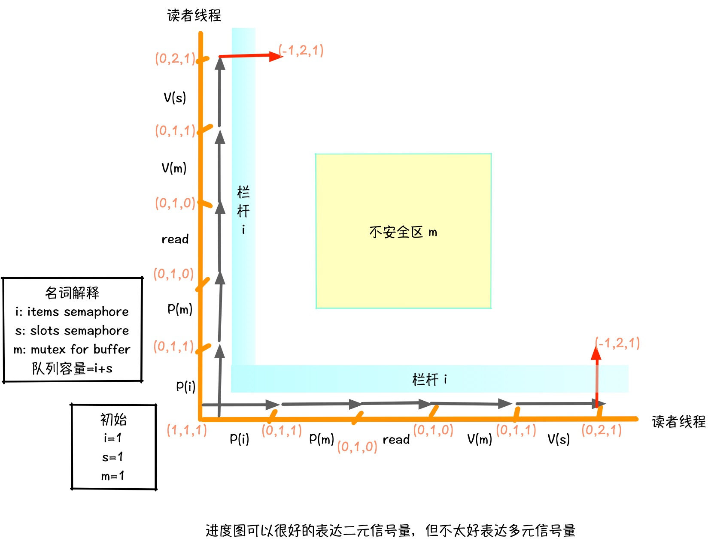

可以看到，多元信号量比二元信号量存在更多的初始情况，这就需要画更多的进度图来分析不同的情况，这虽然增加了很多工作，但进度图的逻辑依然是可靠的。然而这还不是最复杂的情况，如果 PV 操作是有前提条件的话，进度图就更加捉襟见肘了，比如用信号量实现的**读写锁**

**进度图读写锁**

读写锁一般有两种优先级

- 读者优先写饥饿
- 写进入后读排队

第二种显然是比较常用的，实现起来也比前者稍微复杂一些，下面分析一下 Go 语言实现的读写锁，为了简洁起见，我省略了一个用来保护并发写的互斥锁。

读/写线程
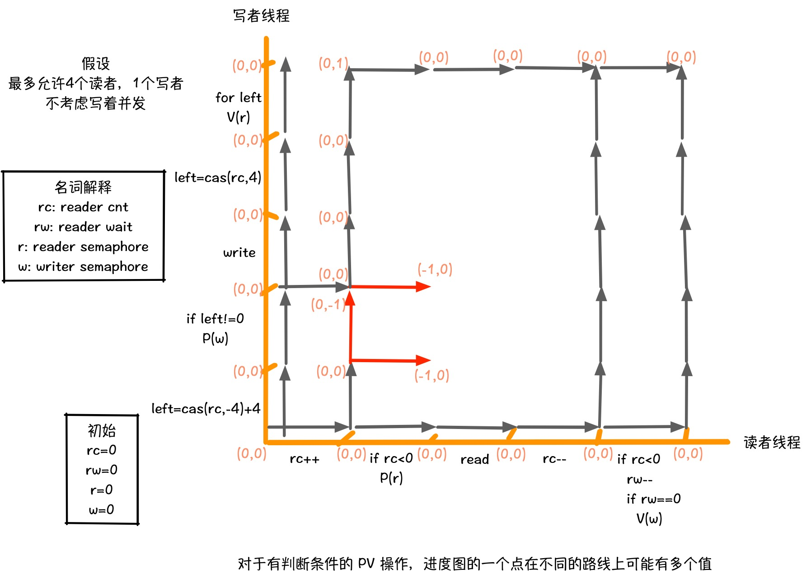

读/写线程，有读者时
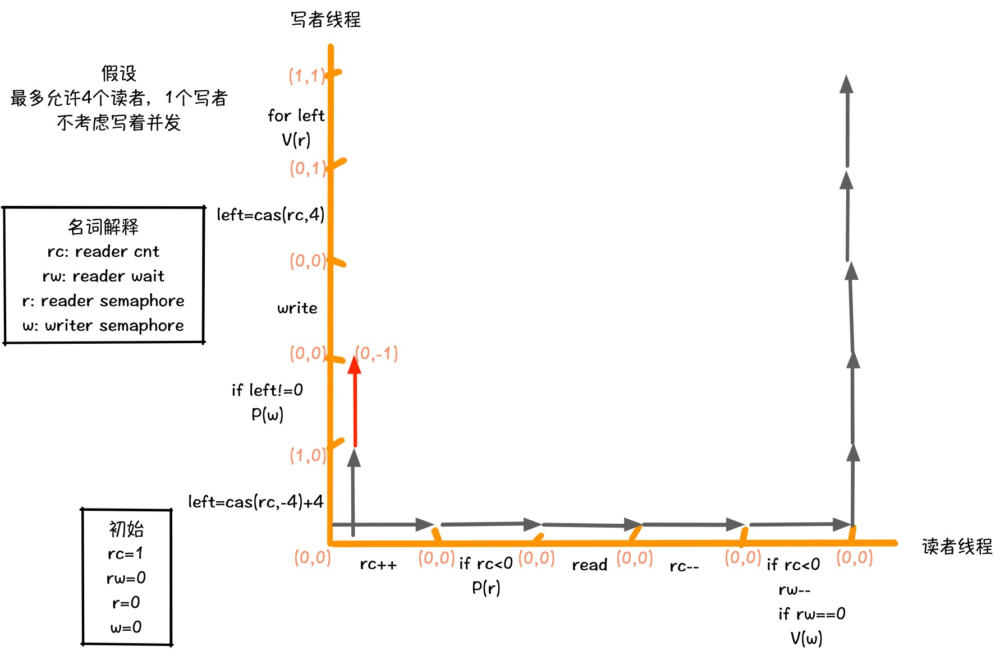

这里我发现一个有趣的事情，对于同一坐标点，不同的行进路线会产生不同的值，这代表一个坐标点存在多个值，只不过对于同一条行进路线来说值是不变的，这就增加了更多的分析路径，但依然可以利用进度图作为并发安全性的一种参考。

## 参考

- 《深入理解计算机系统 (Computer Systems: A Programmer's Perspective)》
- [Semaphores in Plan 9](https://swtch.com/semaphore.pdf)
- https://github.com/golang/go
