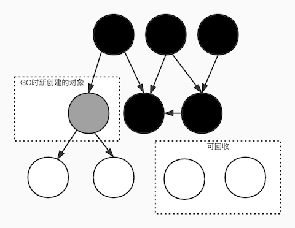

# 理解 Golang 的 GC

## GC

GC 的实现方式主要分为三大类

- 引用计数
- 标记清除
- 复制

具体的定义不是本文要说的，网上很多介绍，也可以看松本行弘的《代码的未来》这本书。

GC 还有很多优化技巧，最重要的两个是**压缩(compact)**和**分代(generational)**

一句话概括 Go 实现的 GC 是采用**不压缩、不分代的并发标记清除**的实现方式。

## SLO

**99%的 SLI 和 99%的 SLO 完全不同**

如果把一次请求视为一项 SLI，用户会话视为 SLO。具体定义可见《SRE：Google 运维解密》。如果一次会话需要 100 次请求来完成，每次请求有 99%的概率正常响应，那一次会话正常响应的概率只有不到 37%。如果想要达到会话级别的 99%的话，那单次请求就需要达到 99.99%。

2014 年，Go 必须要解决 GC 延迟这个命运攸关的问题，所以定下一个 SLO：**GC 停顿小于 10ms**，最终花了将近两年的时间完成它。

**Go GC 的成果**

| 年份   | Go 版本迭代 | GC 停顿                   | 改进                           |
| ------ | ----------- | ------------------------- | ------------------------------ |
| 201508 | 1.4->1.5    | 400ms -> 40ms             | 采用并发标记清除实现           |
| 201605 | 1.5->1.6    | 40ms -> 5ms               | 消除 STW 中 O(heap) 的处理     |
| 201605 | 1.6->1.6.3  | <5ms                      | fix bugs，达成小于 10ms 的 SLO |
| 201608 | 1.6.3->1.7  | <2ms                      | 消除 STW 中 O(heap) 的处理     |
| 201705 | 1.7->1.8    | <1ms per goroutine <100us | 避免 STW 中的栈扫描            |
| 201708 | 1.8->1.9    | 提升微小                  | 细节优化                       |

在 1.9 以后，Go 的 GC 停顿已经控制在微秒级别，已知的可提升空间大概只有 100-200us，Go 需要探索提升更大优化方案，后面再说这部分，我们先总结下 Go 解决 GC 痛点的关键：并发标记清除论文。

## Dijkstra

想了解 GC 的实现如果直接看代码的话是很难的，因为 GC 有太多太多的优化细节散布在代码中，很难把主要逻辑抽离出来，并且代码和注释中会存在很多 paper、design、proposal 中定义的术语，所以要了解 GC 的逻辑需需要找到它最原始的面貌。所以我先从 paper 开始着手。

虽然 Dijkstra 最出名的作品的是他寻径算法，但是他对并发领域贡献是非常大的，他发过的 paper 比如 [Dijkstra 互斥算法](https://www.di.ens.fr/~pouzet/cours/systeme/bib/dijkstra.pdf) 被称为分布式互斥的鼻祖算法，我之前用 C++ 实现了一版简单验证一下[dijkstra-mutex](https://github.com/snowcrumble/dijkstra-mutex)，在团队内做过一次分享。

话说回来，Go 在 1.5 版本引入的并发标记清除垃圾回收就是基于 Dijkstra 在 1978 年发布的 paper [On-the-fly Garbage Collection](https://lamport.azurewebsites.net/pubs/garbage.pdf) 实现的。在这篇论文之前，标记清除 GC 的理论是：标记阶段将堆上所有可达的节点标记，清除时将未标记的节点加入空闲节点列表，具体可见`CSAPP`书中的介绍。标记清除 GC 的痛点是 STW 时间，而论文通过新增一种标记状态来实现并行标记清除，避免了 STW。

### 核心

我总结下论文的核心概念：堆模型和五种操作、三种颜色、两个阶段、并发和摊销。

### 论文介绍

下面介绍下这篇论文的主要内容，不感兴趣可以直接略过看下一节。

**术语**

- mutator：用户代码所在的线程
- collector：GC 线程
- freelist：可回收的对象表
- STW：Stop The World，GC 停顿

**五种操作**

堆模型的定义，用有向图来表示多个数据结构，固定数量的节点，每个图有固定数量的根，每个节点只有两条边，从一个根出发有向可达的节点的集合为一个“数据结构”，孤立的节点为“垃圾”。

基于这个模型，mutator 只有 5 种操作：

1. 将一个可达节点的一条边指向另一个可达节点
2. 将一个可达节点的一条边指向一个不可达节点
3. 给一个无边节点添加一条边指向可达节点
4. 给一个无边节点添加一条边指向一个无边的不可达节点
5. 删除一个可达节点的一条边

其中操作 1、2、5 会创建“垃圾”，操作 2、4 会回收“垃圾”，而 GC 的任务就是找到“垃圾”并清理。Lisp 的 GC 实现是采用原始的同步标记清除方法，它在 STW 期间从根开始遍历，找到“垃圾”并将它们添加到 freelist ，在 freelist 快满的时候清理。这个方法的问题是 STW 时间长，无法预测图中节点的交叉程度。

所以论文中并发标记清除的三个目标是：

1. 尽量的减少线程间的互斥和同步操作，只存在对一个变量的互斥读写操作
2. 尽量减少 GC 与工作线程协调的开销
3. 尽量减少工作线程对 GC 的影响，gc 分为标记阶段和回收阶段，这期间可能会有新的垃圾，这是无法避免的，会交给下个 GC 周期来处理。在标记阶段新增的垃圾也一定会在下一次追加阶段被处理。

关键的地方来了，paper 中用两个特殊节点将 5 种操作简化为 1 种操作，这是一个很神的 trick，完成了相当于“剪枝”的效果。

1. 特殊的 NIL 根，他的左右两边都指向自己，用来表示上面 5 种操作的一些特殊情况，以此来减少需要处理的情况，它可以把操作 3 和 5 作为 操作 1 的一个特例，然后把操作 4 当成操作 2 的特例。
2. 特殊的 freelist 根，不把 freelist 中的当做垃圾，连接 NIL 和所有 freelist 中的节点，并且不连接其他任何节点。这样可以将操作 2 归到操作 1

简化后，mutator 就只剩下一个逻辑：将一个可达节点的一条边指向另一个可达节点。这样一来，需要实现的原子操作就大量减少了。

**三种颜色**

黑、白、灰。颜色迁移的限制：

- 节点颜色不能从深变浅，包括 黑->白，黑->灰，灰->白
- 深色节点不能引用浅色节点

**两个阶段**

在 GC 的两个阶段，mutator 和 collector 会有不同的操作。

标记阶段

- mutator：将一个可达节点的一条边指向另一个可达节点
- collector：标记所有可达的节点，即将所有可达节点变黑，白->黑，灰->黑，灰变黑时要连同其子节点一起。

回收阶段

- mutator：将一个可达节点的一条边指向另一个可达节点，此时将白色节点变灰
- collector：将未标记的节点添加到 freelist，取消其他标记，即将白色垃圾添加到 freelist，把黑色节点变白

**并发和摊销**

论文提出的方法理论上是不需要 STW 的，mutator 和 collector 可以完全并发运行，这样可以利用多核 CPU，并发标记、并发回收，只是每次 mutator 修改对象时都需要做额外的判断，以此来摊销老的标记清除方法的停顿时间。不过实现上没有 STW 不一定是最合理的，反而会影响性能，乍一听有点反直觉，但这是因为全局**写屏障**的存在，比如 Go 会用 STW 来开关写屏障来减少对 GC 期之外工作任务的影响。

## 实现

Go 基于 Dijkstra 的实现引入了一些附加物

**写屏障（write barrier）**

Go 的写屏障将当前可访问的对象从白色变为灰色，具体实现跟 CPU 架构相关。比如，go 用汇编来实现的 X86 架构的写屏障 [runtime·gcWriteBarrier](https://github.com/golang/go/blob/go1.15.2/src/runtime/asm_amd64.s#L1395)。Go 会在编译时将写屏障注入到代码中。写屏障仅在标记阶段和标记中止阶段开启，或是 cgo 检查时。另外，Go 对 write barrier 还做了一些优化，混合使用 `Yuasa-style deletion` 和 `Dijkstra insertion`，引入**write barrier buffer**来优化 per-P 的单独指针的写屏障，对一些涉及到内存排序的场景，用幂等的覆盖写操作代替使用写屏障来保证执行顺序等。

**计步器（pacing）**

用于调控 GC 触发时机，主要从两个方面进行调控下次 GC 的时机：内存增长情况和 CPU 使用情况。GC 标记阶段后台会占用最多 25% 的 CPU，比如程序使用四个 P 运行的话，GC 会占用其中一个 P，并且会固定在这个 P 上运行标记的 goroutine。这是正常的情况，但是如果新分配的速度大于标记的速度，那就需要一些额外的 标记辅助(Mark assist) goroutine 占用其他的 P 去辅助标记，Mark assist 做的工作跟 GC 的标记工作一样，不过会分块处理，每次最多处理 64k 内存，因此两次处理的间隙可以让用户的 goroutine 被调度。而需要的 assist 数量会根据内存增长情况和 CPU 负载情况进行动态调整，这就是 pacing 的工作，它是基于一种反馈控制算法，具体实现在 [runtime/mgc.go](https://github.com/golang/go/blob/go1.15.2/src/runtime/mgc.go#L336)中。

## 开发者

在理解了 Go GC 的实现理论后，开发者可以让自己的代码与 GC 更好的配合，有写需要注意的地方，在 GC 阶段，有短暂的 STW 用以开启、关闭写屏障，这需要停止所有 goroutine，通常只需要几十微秒，但需要开发者：

- 尽量减少分配到堆的代码，这样可以直接减少 GC 的压力，因为需要标记清除的对象减少了，可以利用逃逸分析工具观察哪些变量逃逸到堆中，其中哪些是可以避免的。
- 尽量不要写循环分配堆内存的代码，尽量将循环中分配内存的操作移提出到循环外。

## 质疑

有很多人对 Go GC 的质疑是因为 Go 1.5 之前的 GC 真的很慢，那是直接影响在是否生产环境中使用 Go 的因素，但这已经是过去式了。其他的一些质疑是为什么 Go 不采用压缩、也不采用分代的优化方案，Go 团队对此也有所回应：

**分代（Generational）**

分代 GC 基于一个假设，大多数对象都是临时用一下马上就释放了，分代可以帮助 GC 更快的找到这些对象，这可以减少 STW 时间，但是 Go 编译器会做逃逸分析，它会将大部分临时变量在栈中分配。同时 Go 还采用并行 GC 的算法，STW 时间非常短，清理会在程序运行时后台进行。不过分代 GC 依然可能减少后台清理的时间。

**压缩（Compact）**

压缩是为了避免内存碎片，这可以让你使用最简单的内存分配器来提高性能，简单的 bump allocator 在单线程下很快，但是多线程需要加锁。但是现代的内存分配器已经避免了内存碎片，ptmalloc、tcmalloc、jemalloc，go 的内存分配器在 tcmalloc 的基础上开发的。另外，Go 采用的是 per-P caches(mheap)，小于 32kb 的对象会在 mheap 上分配，大对象才会在 heap 上。

在众多的质疑声音中，有一篇比较专业的来自 2016 年 12 月的 [文章](https://blog.plan99.net/modern-garbage-collection-911ef4f8bd8e#.3dan5aqgm)，作者对 GC 的理论的了解很全面，但是对 Go 团队的 GC 设计理念没有充分的理解，他认为 Go 太过在意 GC 停顿而对 GC 的其他功能做出了取舍了，比如内存碎片导致的浪费。但是 Go 团队深刻分析了摩尔定律对硬件的影响，比如他们总结发现摩尔定律对 CPU 的影响虽然明显变弱，但是对内存来说还是有一定参考价值，所以他们认为未来五年甚至十年内存的成本相比 CPU 会降幅更大，所以 Go 设计 GC 的目标是基于这个预测，那么内存的浪费当然就被“取舍”了，并且像 tcmalloc、jemalloc 这种现代内存分配器已经对内存碎片进行了很大程度的控制，所谓的内存浪费并不明显，除非是在特定领域，比如内存特别小的嵌入式设备。

作者还认为 Go 的非抢占式调度的设计会让紧循环计算直接影响 STW 时间，比如解码大块的 base64 数据，这在文章发布日期确实是个问题，不过在 2015 年就已经有关于抢占紧循环的相关 [issue](https://github.com/golang/go/issues/10958)，并在 2020 年 Go1.14 版本解决了这个问题。不过文章提出的另一个问题——吞吐量——确实是 Go 的 GC 目前的弱点，堆内存分配速度越快，GC 占用的 CPU 时间就越多，Go 会动态调节以达到分配速度与标记速度的平衡，这就会影响到应用程序的吞吐量。但是 Go 的逃逸分析也会尽可能避免这种情况的发生，其他的就要交给开发者对 Go GC 的同理心了，尽量写出值传递的代码，而且分代 GC 也不能解决吞吐量的难题。而关于 Go 采用“双倍堆”的问题，在 Go 看来这属于“设计如此”，Go 提供的数据分析表明，堆开销的增长与写屏障的影响是成反比的，所以双倍堆可以提高性能，这也是 Go 的取舍。

## 未来

很多人都会对标记清除的 GC 方案会有先入为主的看法，认为它是十分老旧的，问题很多的方法，觉得它只适合在大学课程中以此作为 GC 章节的讲解。采用标记清除的古董语言 Lisp 就被人诟病 GC 很慢，Objective-C 引入标记清除 GC 后发现很多问题，很快就用引用计数的版本替换掉了，不过引用计数方案也有它的问题，比如循环引用需要额外解决，性能问题，它采用的意外摊销（accidentally amortized）策略不能保证响应时间。

虽然 Go 的 GC 已经十分出色了，但是 Go 团队依然没有放弃持续寻找优化空间，分代 GC 是一个实现简单，又节约内存的方案，没有明显缺点，Go 在 2018 年制定新的 SLO 之后，尝试了一个**ROC (Request Oriented Collector)** 的方案，但是效果并不理想，最后还是把目光挪到了分代 GC，但是 Go 需要保持面向值的属性，所以需要实现非移动、非复制的分代 GC，通过 bitset 来标记上次 gc 保留下来的指针，但 benchmark 表现不行，这是由于分代 GC 需要全局开启写屏障，虽然可以优化但开销不可避免，另外值传递和逃逸分析大幅降低了“年轻指针”，这让分代 GC 的优势发挥不出来。Go 又尝试用哈希表来维护老指针的标记，这可以去掉 GC 期之外写屏障，以哈希计算的开销来替换写屏障的开销，同时用加密级别的哈希来避免处理哈希碰撞，不过结果依然几乎没有提升。所以 Go 接下来要做的只能是继续优化写屏障，完善逃逸分析的一些[缺陷](https://docs.google.com/document/d/1CxgUBPlx9iJzkz9JWkb6tIpTe5q32QDmz8l0BouG0Cw/edit#heading=h.n6xah83txgl1)。

## 引用

[On-the-fly Garbage Collection](https://lamport.azurewebsites.net/pubs/garbage.pdf)

[Getting to Go: The Journey of Go's Garbage Collector - The Go Blog](https://blog.golang.org/ismmkeynote)

[Go GC: Prioritizing low latency and simplicity](https://blog.golang.org/go15gc)

[go1.15.2 source code](https://github.com/golang/go/tree/go1.15.2)

[Garbage Collection In Go : Part I - Semantics](https://www.ardanlabs.com/blog/2018/12/garbage-collection-in-go-part1-semantics.html)

[Garbage Collection In Go : Part II - GC Traces](https://www.ardanlabs.com/blog/2019/05/garbage-collection-in-go-part2-gctraces.html)

[Garbage Collection In Go : Part III - GC Pacing](https://www.ardanlabs.com/blog/2019/07/garbage-collection-in-go-part3-gcpacing.html)

[Visualizing Garbage Collection Algorithms](https://spin.atomicobject.com/2014/09/03/visualizing-garbage-collection-algorithms/)

[runtime: clean up async preemption loose ends · Issue #36365 · golang/go · GitHub](https://github.com/golang/go/issues/36365)

[Go 1.5 concurrent garbage collector pacing](https://docs.google.com/document/d/1wmjrocXIWTr1JxU-3EQBI6BK6KgtiFArkG47XK73xIQ/edit#)

[Request Oriented Collector (ROC) Algorithm - Google 文档](https://docs.google.com/document/d/1gCsFxXamW8RRvOe5hECz98Ftk-tcRRJcDFANj2VwCB0/view)

[Why golang garbage-collector not implement Generational and Compact gc?](https://groups.google.com/g/golang-nuts/c/KJiyv2mV2pU)
