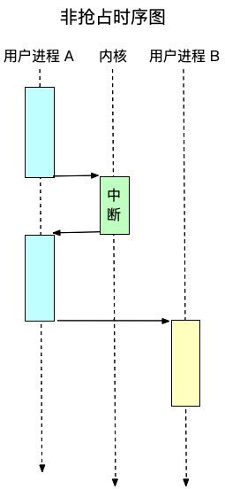

# 自底向上理解 Go 的异步抢占

本文从底层硬件到内核再到Go语言运行时来理解 Go 的异步抢占

## 异常与中断

异常与中断在不同的场景下的定义不太一样，比较容易混淆，本文采用的是 CPU 层面的语义。CPU 提供中断信号，有同步和异步的，Intel 微处理器手册分别将其称为异常和中断。

- 异常，同步触发，常用于系统调用、trap、内存缺页、硬件故障灯。
- 中断，异步触发，常用于硬件发出的中断信号，比如 CPU、磁盘、网卡、键盘、时钟等。

操作系统内核会对这些异常和中断进行相应的处理，在保护硬件的前提下给用户提供服务。《深入理解 Linux 内核》书中有一个易于理解的比喻：内核好比是一个服务员，硬件是老板，应用程序是顾客。同步中断比喻为顾客的请求，异步中断是老板的请求。老板可以随时叫你做事，顾客只能在你提供服务的时候叫你做事。服务员通常服务完一位顾客之后再去服务下一位顾客，而老板可以命令你先把当前的顾客晾一晾，先去服务另一位顾客。我想同步中断就好像陷阱，一定需要预先埋好，并且只有走到了那里才会触发，是主动的，而异步中断可以在任意时刻出现，是被动的。

## Linux 中断处理

Linux 就是利用异常和中断来实现同步和异步的抢占的，其实严格的来说，“同步抢占”这个词不太恰当，或可以称之为”同步进程切换“，内核在中断时仅仅做了一个标记，然后在用户进程的某个时间点进行真正的进程切换，这种方式体现不出”抢“的感觉。Go 语言也是类似这样的逻辑，虽然 Go 美其名曰“协调式抢占”，但对于 Linux 来说这种同步的进程切换叫做“非抢占”或”用户抢占“。

话说回来，发生进程切换时，内核所要做的事情主要是两点：

- 切换全局目录以安装新的地址空间
- 切换内核态堆栈和保存硬件上下文

上面第一点通常发生在同步切换，比如 shell 进程执行一个命令时，内核需要为这个命令的进程开辟新的地址空间，这部分主要是虚拟内存相关，跟抢占关系不大。而第二点则是同步和异步都需要做的，对于内核而言，切换内核态堆栈就是切换不同的进程。内核的堆栈跟我们常见的用户进程的堆栈模型是完全不同的，不同的堆栈区域涉及不同的进程。而硬件上下文主要是指 CPU 寄存器。保存硬件上下文是因为有虚拟内存的存在，进程的内存可以认为是”独占“的，但是 CPU 寄存器却是共享的，所以切换进程时，你要给新进程预留所有它可能用得到的 CPU 寄存器，而之前寄存器中的存放的内容也需要保存起来，暂时压到内核的栈中。

_用两个时序图就可以清楚的理解抢占和非抢占的区别_




## 协调式抢占

Go 在 1.14 之前是协调抢占，这种调度方式遭到许多吐槽甚至鄙视，其实大可不必，因为 Linux 也是在 2.6 才正式引入内核抢占，在那之前进程切换延迟可达到上百毫秒，我们要对一种技术的发展进程有些同理心。协调式抢占其实就是在编译时把抢占逻辑插桩在函数入口处。这种方式在大部分情况下是 OK 的，但是总会有些极端的例子出现造成开发者的困扰，因为一旦出现这种情况，会出现非常奇怪并且难以排查的问题，比如有时会导致整个程序冻结，这属于 Go 的一个 bug。

### 为什么 Linux 和 Go 在一开始的时候都选择了非抢占调度呢？

一是因为他的实现复杂度相对较低，前面说到，进程切换需要保存 CPU 寄存器，而在函数调用时，编译器会帮你做这些工作，比如 x86 的 `CALL with USES Operator`，类似一个宏，可以在函数调用时自动插入保存 CPU 寄存器的汇编代码。而异步抢占的时机可能是进程的任意语句，你总不能指望编译器把每条语句都插入保存寄存器的代码，你必须在抢占时刻手动实现这个逻辑，而这就意味着你需要手写不同平台的汇编来保证你程序的跨平台兼容性。而跨平台对 Linux 和 Go 来说都是不可或缺的特性。

二是对于 Go 来说的，因为 Go 是带有 GC 的语言，GC 的工作就是要扫描所有的指针然后标记-清除，而确保所有指针都可以被扫描到的时机，称之为 `safe-points`，它保证了`GC 原子性`，所以在切换 goroutine 时需要保证所有 goroutine 栈上的指针都可以被扫到，Go 的协调式抢在函数入口处插入一个逻辑：_检查栈边界，如果有抢占请求则进入抢占逻辑_。其中检查栈边界就可以保证当前处于 `safe-points`，因为所有临时变量都在栈边界以内。而异步抢占则需要考虑很多问题，比如 Go 的写屏障被认为是一个 GC 相关的原子操作，抢占时要确保当前的指令不在写屏障操作内，还要判断是否有足够的剩余栈空间来插入异步抢占代码，以及是否是 cgo 的代码等等琐碎繁杂的处理。

所以在初期，Linux 和 Go 都选择了相对简单的非抢占调度。但随着它们被大家广泛的使用，发现很多问题后才改成抢占调度。

## Go 的异步抢占

关于如何减缓协调式抢占带来的问题，Go 团队曾提出过一些”打补丁“式的方案，比如，想办法在循环中插桩，来避免紧循环长时间占用 CPU。但问题是这会降低性能，而且通常循环中的计算都是需要高性能的。因此，Go 必须要实现抢占式调度。这样不仅可以在任意时间进行抢占，不需要显示的抢占检查，还可以解决“延迟抢占”和“运行时开销”的问题。那么接下来就是如何实现异步抢占。

### Go 异步抢占的实现

操作系统内核基于 CPU 的中断信号来实现线程级抢占。而对于 Go 来说，runtime 不能触及硬件信号，因为 Go 通常是用来开发用户程序的，需要基于一种内核提供的服务来实现。一种方案是通过 POSIX 信号来实现 goroutine 抢占。发送一个 SIGURG 信号用来停止运行的 goroutine 并捕获 CPU 状态。_如果 goroutine 在保持 GC 原子性时被打断，runtime 可以简单的恢复它并稍后重试_。基于 POSIX 信号的好处是跨平台兼容性，像 Windows 也有 POSIX 接口。选用 SIGURG 信号主要是因为它几乎是一个没用的信号。

_基于 POSIX 信号的结构图


每个 goroutine 都会运行在某个线程上，如上图中 G1 运行在 M1 上，runtime 有一个 sysmon 作为后台 goroutine，他会检测每个 goroutine 的运行时长，如果超过 10ms 就会发送一个 SIGURG 信号给该 goroutine 所在的线程，线程收到信号后立即中断，进入抢占处理。

### 源码解析

了解以上的内容后，可以帮助我更容易的理解源码，下面我摘取一些源码来解读异步抢占的实现，我忽略了一些对理解没有帮助的代码，同时加入了一些帮助理解的注释。

_代码版本 go-1.14.13_

线程收到 SIGURG 并且当前处于 safe-points 时，就会调用 `asyncPreempt` 函数。

```go
//preempt.go
// asyncPreempt saves all user registers and calls asyncPreempt2.
func asyncPreempt()

//signal_unix.go
// doSigPreempt handles a preemption signal on gp.
func doSigPreempt(gp *g, ctxt *sigctxt) {
    // Inject a call to asyncPreempt.
    ctxt.pushCall(funcPC(asyncPreempt))
}

// Make it look like the signaled instruction called target.
func (c *sigctxt) pushCall(targetPC uintptr) {
    pc := uintptr(c.rip())
    sp := uintptr(c.rsp())
    sp -= sys.PtrSize
    *(*uintptr)(unsafe.Pointer(sp)) = pc
    c.set_rsp(uint64(sp))
    c.set_rip(uint64(targetPC))
}
```

可以看到，在收到抢占信号后，用 `pushCall` 函数给当前线程注入一个函数调用 `asyncPreempt`，要了解它是怎么注入进去的，要先了解一些基本概念：

- PC：program counter，下一条要执行的指令。[程序计数器](https://zh.wikipedia.org/wiki/%E7%A8%8B%E5%BC%8F%E8%A8%88%E6%95%B8%E5%99%A8)
- SP：stack pointer，当前栈顶地址的指针。
- BP：base pointer，当前栈帧底部地址的指针，SP 是基于 BP 的偏移量，通常进入一个函数需要开辟一个栈帧，所以为了简单起见，BP 可以直接理解为当前函数的起始栈地址。
- RIP：register instruction pointer，下一条要执行的指令地址的寄存器，理解为 x86 版 PC。
- RSP：register stack pointer，当前栈顶指针的寄存器。

_抢占时的 CPU 和内存状态_


`pushCall` 就是在执行下一条指令之前插入一个函数。因为函数调用时会开辟新的栈帧并将之前的 bp 压栈，将 sp 指向 新的 bp，函数返回时会释放栈帧并将 sp 指向 当前的 bp，然后将之前压入的 bp 出栈。所以 `pushCall` 将本来用户要执行的指令入栈，插入一个函数，当插入的函数返回后，会 pop 出原指令继续执行。

_pushCall示意图_


插入的 `asyncPreempt` 函数是用汇编写的，在 Go 代码中只是声明一下，不同平台用相应的汇编语言实现，来看一下 x86 架构对应的汇编代码

```go
//preempt_amd64.s
TEXT ·asyncPreempt(SB),NOSPLIT|NOFRAME,$0-0
    // save bp
    PUSHQ BP
    // set bp with sp
    MOVQ SP, BP
    // save flags
    PUSHFQ
    // save sp. Adjust Stack Pointer
    ADJSP $368
    // But vet doesn't know ADJSP, so suppress vet stack checking
    NOP SP
    // save registers. x(r) means x+r
    MOVQ AX, 0(SP)
    MOVQ CX, 8(SP)
    MOVQ DX, 16(SP)
    ...
    //it is safe-points now
    CALL ·asyncPreempt2(SB)
    // recorver registers
    ...
    MOVQ 16(SP), DX
    MOVQ 8(SP), CX
    MOVQ 0(SP), AX
    // recorver sp
    ADJSP $-368
    // recorver flags
    POPFQ
    // recorver bp
    POPQ BP
    RET
```

这里用汇编实现了在真正执行抢占逻辑之前和之后分别保存和恢复原栈帧，flags，寄存器。代码中我做了简单的注释来解释各个逻辑。这就是我前面说的异步抢占实现麻烦的一个地方，就是需要用不同平台的汇编实现本来函数调用可以自带的逻辑。

下面的 `·asyncPreempt2` 是真正的抢占函数。

```go
// park user's goroutine
func asyncPreempt2() {
    gp := getg()
    gp.asyncSafePoint = true
    if gp.preemptStop {
        // gc goroutine
        mcall(preemptPark)
    } else {
        mcall(gopreempt_m)
    }
    gp.asyncSafePoint = false
}

func gopreempt_m(gp *g) {
	if trace.enabled {
		traceGoPreempt()
	}
	goschedImpl(gp)
}

func goschedImpl(gp *g) {
	status := readgstatus(gp)
	if status&^_Gscan != _Grunning {
		dumpgstatus(gp)
		throw("bad g status")
	}
    // stop goroutine
	casgstatus(gp, _Grunning, _Grunnable)
	dropg()
    // push goroutine to the global run queue
	lock(&sched.lock)
	globrunqput(gp)
	unlock(&sched.lock)

    // find and run a runnable goroutine from the global run queue or per-P's local run queue or steal from other P's.
	schedule()
}
```

最后回到了 Go 的 GMP 调度模型，`gopreempt_m` 函数将被抢占的 goroutine 从 M（线程） 上卸下来，追加到全局运行队列的尾部（运行队列是一个双端队列），然后让 M 所关联的 P（逻辑处理器） 去寻找一个可用的 goroutine 去运行，寻找时按照 `全局队列-本地队列-偷其他P的本地队列` 的优先级。

## 总结

总的来说，了解 Go 的异步抢占的过程比较开心，趁机复习下汇编相关的知识，学习下Linux内核，也加深了对 Go 的理解，因为异步抢占还涉及到了 Go 的 GC 和调度模型，增加了知识关联性有助于记忆。俗话说做加法容易，做减法难，在对引用和源码做减法时，你要先了解它到底跟你想了解的内容有没有强关联，或者对理解上有没有帮助。在其中抽丝剥茧并结合自己的理解可以说是我的初衷吧。

## 参考资料

- https://github.com/golang/proposal/blob/master/design/24543-non-cooperative-preemption.md
- https://github.com/golang/go/tree/go1.14.13
- https://medium.com/a-journey-with-go/go-asynchronous-preemption-b5194227371c
- https://cs.pomona.edu/~ebirrell/classes/cs105/2020fa/lectures/07-Assembly3/Assembly3.pptx
- 《深入理解 Linux 内核》
- 《汇编语言：基于x86处理器》
- https://sites.google.com/site/acmfreakrobot/kernel/qiang-zhan-shi-nei-he
